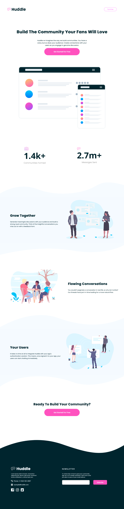

# Frontend Mentor - Huddle landing page with curved sections solution

This is a solution to the [Huddle landing page with curved sections challenge on Frontend Mentor](https://www.frontendmentor.io/challenges/huddle-landing-page-with-curved-sections-5ca5ecd01e82137ec91a50f2). Frontend Mentor challenges help you improve your coding skills by building realistic projects.

## Table of contents

- [Overview](#overview)
  - [The challenge](#the-challenge)
  - [Screenshot](#screenshot)
  - [Links](#links)
- [My process](#my-process)
  - [Built with](#built-with)
  - [What I learned](#what-i-learned)
  - [Continued development](#continued-development)
  - [Useful resources](#useful-resources)
- [Author](#author)
- [Acknowledgments](#acknowledgments)

## Overview

- This is a solution to Huddle landing page with curved sections challenge on Frontend Mentor. This is a Junior challenge. To do this challenge, you need a basic understanding of HTML and CSS. I have tried to get the solution looking as close to the design as possible

### The challenge

Users should be able to:

- View the optimal layout for the site depending on their device's screen size
- See hover states for all interactive elements on the page

### Screenshot



### Links

- Frontend Mentor Solution URL: (https://www.frontendmentor.io/solutions/huddle-landing-page-with-curved-sections-masterchallenge-PPjspkn-qJ)
- Live Site URL: (https://noura201.github.io/Frontend_Mentor_03_huddle-landing-page-with-curved-sections-master_challenge/)
- MyPersonal Linkedin URL: (https://www.linkedin.com/in/noura-mamdouh-8a81982a4/)

## My process

### Built with

- Semantic HTML5 markup
- CSS custom properties
- CSS Position Properties

### What I learned

I have learned more while working through this project such as:

- Creating Some Specific Buttons
  Code:

```css
.build-community-div .get-started-btn1 {
  width: 400px;
  height: 80px;
  margin-top: 40px;
  font-size: 20px;
  font-weight: 400;
  font-family: "OpenSans-Bold";
  text-transform: capitalize;
  border-color: transparent;
  border-radius: 40px;
  color: hsl(207, 100%, 98%);
  background-color: hsl(322, 100%, 66%);
}
.build-community-div .get-started-btn1:hover {
  cursor: pointer;
  background: radial-gradient(hsl(322, 100%, 66%), hsl(321, 100%, 78%));
}
```

- Dealing With CSS Position Properties
  Code:

```css
.screen-mockups {
  position: relative;
  top: 400px;
  width: 1000px;
  margin-left: calc((1326px - 1000px) / 2);
  margin-right: calc((1326px - 1000px) / 2);
}
```

- Creating Wavy Background [Top-Middle-Bottom]
  Code:

```css
.grow-together-section .top-section {
  height: 165px;
  background-image: url("images/bg-section-top-desktop-1.svg");
}
.grow-together-section .middle-section {
  height: 400px;
  position: relative;
  background-color: hsl(207, 100%, 98%);
}
.grow-together-section .bottom-section {
  height: 139px;
  background-image: url("images/bg-section-bottom-desktop-1.svg");
}
```

- Dealing With html form [input element]
  Code:

```html
<form>
  <input
    type="email"
    id="email"
    name="email"
    class="subscription-input"
    required
  />
</form>
```

### Continued development

- I would like to train more about position property
- I'm seeking to do more realistic projects to improve my coding skills.
- I want to learn more about the important CSS Properties: Grid - Flexbox.
- I would like to train more about grouping multiple selectors perfectly to write a clean code and save more time and effort.

### Useful resources

- I have used the following font icon library: [Font Awesome](https://fontawesome.com/)
- When I faced an obstacle, I have searched on chatgpt to help me solve my problem.

## Author

- Github - [@NouraMamdouh](https://github.com/Noura201)
- Frontend Mentor - [@NouraMamdouh](https://www.frontendmentor.io/profile/Noura201)
- Linkedin - [@noura mamdouh](https://www.linkedin.com/in/noura-mamdouh-8a81982a4/)

## Acknowledgments

- I really have completed this challenge by myself.
